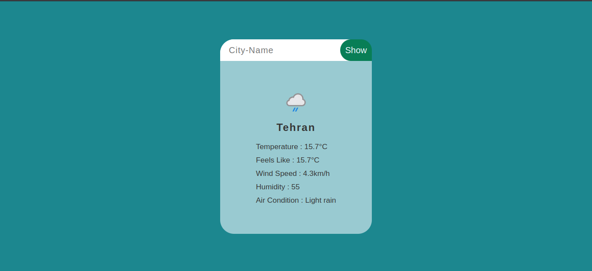
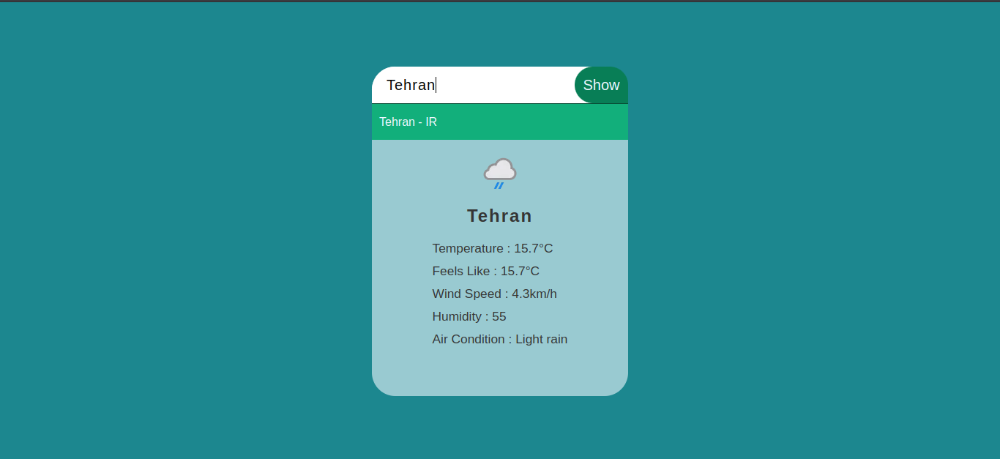

# 🌦️ Weather App with City Suggestion

A simple, responsive weather web application built using **JavaScript**, **HTML**, and **CSS**, which allows users to search for any city and instantly view current weather data.

This app features **real-time city suggestions** using the [API Ninjas City API](https://api-ninjas.com/api/city) and live weather data from the [WeatherAPI](https://www.weatherapi.com/).

---

## 🔍 Features

- 🌇 **City Auto-Suggestion** as you type  
- ☁️ **Real-time Weather Data** based on selected city
- 🌡️ Feels-like temperature, wind speed, humidity, and more
- 🌤️ Weather condition icons & readable summaries
- 💡 Error handling for invalid inputs or API issues
- 📱 Responsive layout (mobile & desktop friendly)

---

## 📷 Preview



---

## 🔧 Tech Stack

- **HTML5**
- **CSS3**
- **JavaScript (ES6+)**
- **[API Ninjas - City API](https://api-ninjas.com/api/city)** for location search
- **[WeatherAPI](https://www.weatherapi.com/)** for weather data

---

## 🚀 Getting Started

1. **Clone the repository:**

   ```bash
   git clone https://github.com/your-username/weather-app.git
   cd weather-app
   ```

2. **Replace API keys:**

   In your JavaScript file (e.g. `script.js`), insert your API keys:

   ```javascript
   const city_api_key = "YOUR_API_NINJAS_KEY";
   const weather_api_key = "YOUR_WEATHERAPI_KEY";
   ```

3. **Open in browser:**

   Just open `index.html` in your favorite browser.

---

## 🗝️ Get Your Free API Keys

- [API Ninjas City API](https://api-ninjas.com/api/city)
- [WeatherAPI](https://www.weatherapi.com/)

> Both services offer free tiers with generous limits.

---

## 📁 Project Structure

```
weather-app/
├── index.html
├── style.css
├── script.js
└── README.md
```

---

## ❓ How It Works

1. User types a city name
2. City API returns a list of matching cities
3. On selecting a city, the app fetches its city name
4. WeatherAPI returns the current weather for that city name
5. Weather data is displayed in the UI

---

## ✅ To-Do / Improvements

- [ ] Add 3-day forecast
- [ ] Dark mode support
- [ ] Loading spinner instead of text
- [ ] Save recent searches to local storage

---

## 📄 License

This project is licensed under the [MIT License](LICENSE).

---

## 🙌 Acknowledgements

- [API Ninjas](https://api-ninjas.com/) for city data
- [WeatherAPI](https://www.weatherapi.com/) for weather data

---

Happy coding! 🌍💻